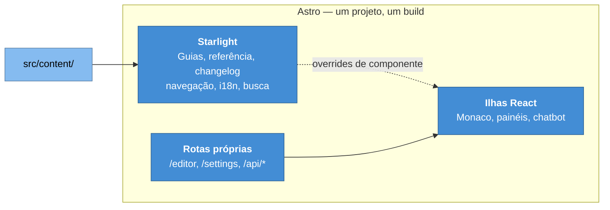

# ADR-0001 — Astro e Starlight como base do portal

**Status:** Aceita · **Data:** 2025-11 · **Nível C4:** Contêiner

## Contexto

O portal precisa publicar guias, referência de API e changelog em três idiomas,
com busca, navegação por diretório e tema claro e escuro. Precisa também
hospedar um editor, rotas de API e telas de administração.

Duas famílias de ferramenta resolvem a primeira metade:

- **Geradores de site estático de documentação** — Docusaurus, MkDocs, VitePress,
  Starlight. Entregam navegação, busca e i18n prontos.
- **Frameworks de aplicação** — Next.js, Remix, SvelteKit. Entregam rotas de API
  e renderização no servidor, e deixam a documentação por conta de quem escreve.

A segunda metade — editor, API, administração — é uma aplicação. A primeira é um
site. Escolher só uma família significa construir a outra à mão.

## Decisão

Usamos **Astro** como framework e **Starlight** como camada de documentação.

Astro é um framework de aplicação que renderiza estático por padrão e permite
rotas de servidor onde for preciso. Starlight é um tema de documentação
construído sobre ele — não um gerador separado.

As duas metades ficam no mesmo projeto, com o mesmo build e o mesmo roteamento.

## Consequências

**O que melhorou.** Um build, um servidor, um roteamento. O editor grava um
arquivo em `src/content/docs/` e o site publicado passa a servi-lo, sem
sincronização entre dois sistemas.

As ilhas de React carregam só onde são usadas: o Monaco pesa no editor e não
pesa numa página de guia, porque a página de guia é HTML estático.

**O que custou.** Ficamos presos às escolhas da Starlight sobre estrutura de
navegação e frontmatter. Alterar o comportamento dela exige *override* de
componente — o projeto tem sete, em `src/components/`, e cada um é um ponto onde
uma atualização da Starlight pode quebrar.

Um aviso de build documenta esse custo: o plugin `starlight-videos` quer
sobrescrever `PageTitle`, que o projeto já sobrescreve, e os dois não convivem.

**O que passou a ser possível.** Rotas de API no mesmo projeto que o conteúdo
foram o que permitiu o editor, o chatbot, o API Explorer e as telas de
administração existirem sem um segundo serviço.

## Alternativas consideradas

**Docusaurus.** Maduro e com ecossistema grande, mas é um gerador de site: rotas
de API exigiriam um backend separado, e o editor viveria noutro processo, com
outro deploy e outra autenticação.

**Next.js sem tema de documentação.** Resolveria a aplicação e deixaria por
nossa conta navegação, i18n, busca, breadcrumbs, paginação e tema — meses de
trabalho para chegar onde a Starlight começa.

**Dois projetos.** Um site estático e uma aplicação separada. Foi descartado
pelo custo de manter dois deploys, duas autenticações e um contrato entre eles
para uma coisa que é um produto só.
