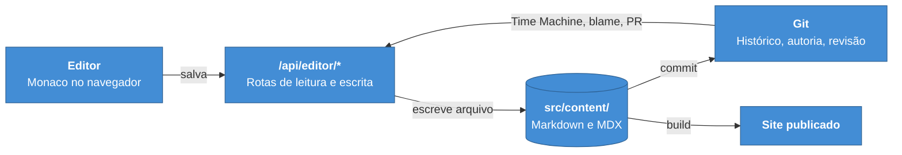

# ADR-0002 — Git é a única fonte de verdade do conteúdo

**Status:** Aceita · **Data:** 2025-11 · **Nível C4:** Contexto e Contêiner

## Contexto

Um portal com editor precisa guardar o conteúdo em algum lugar. A escolha
convencional para um CMS é um banco de dados: consultas rápidas, permissões por
registro, e um editor que grava direto.

Mas a documentação técnica deste portal tem duas propriedades que a distinguem
de conteúdo de CMS:

1. **Ela é revisada como código.** Um endpoint que muda de nome exige mudar a
   documentação, e as duas coisas deveriam entrar no mesmo pull request.
2. **Ela precisa de histórico com autoria e motivo.** "Quem mudou este parágrafo,
   quando, e junto de que outra mudança" é a pergunta que aparece quando a
   documentação contradiz o produto.

Um banco responde a primeira mal e a segunda com uma tabela de auditoria que
alguém precisa construir e ninguém consulta.

## Decisão

**Todo o conteúdo vive em arquivos Markdown e MDX versionados pelo Git.** Não há
banco de dados de conteúdo, e o editor grava arquivos.

## Consequências

**O que melhorou.** Revisão de documentação usa pull request, com diff linha a
linha e os mesmos revisores do código. Reverter é `git revert`. O histórico é o
do Git, com autor, data e mensagem — sem tabela de auditoria paralela.

Esta decisão é o que torna possíveis a [Time Machine](../../src/content/docs/guides/time-machine.mdx),
a análise de impacto e o Documentation-to-Code Loop. Nenhuma delas
funcionaria sobre um banco sem reconstruir o Git dentro dele.

**O que custou.** Busca e filtro exigem varrer arquivos, o que é mais lento que
uma consulta indexada. Os motores de análise contornam isso com cache em
memória e leitura sob demanda, mas o custo é real numa base grande.

Escrita concorrente não tem transação. Dois autores no mesmo arquivo produzem o
que o Git produz — conflito — em vez de um bloqueio otimista.

E o portal precisa do sistema de arquivos: não dá para rodar em plataforma de
função sem disco persistente.

**O que passou a ser possível.** O conteúdo sobrevive ao portal. Se este projeto
for abandonado amanhã, o Markdown continua legível, versionado e publicável por
qualquer outra ferramenta. Um banco proprietário faria a documentação refém do
software que a serve.

## Alternativas consideradas

**Banco relacional com editor CRUD.** Resolveria a concorrência e a busca. Foi
descartado porque separa a documentação do código: o pull request que muda o
endpoint não muda a documentação, e as duas coisas divergem sem que nada acuse.

**Banco como cache do Git.** O Git continua sendo a fonte, e um banco espelha
para consulta. Foi descartado por criar dois lugares onde a mesma informação
existe. A experiência das camadas seguintes confirmou o receio — ver
[ADR-0005](0005-camadas-derivadas.md), onde o mesmo padrão aparece resolvido de
outro jeito: derivar sempre, nunca persistir como verdade.

**Headless CMS.** Terceiriza o problema e cria um sistema externo do qual o
build passa a depender. Contraria [ADR-0016](0016-degradacao-em-vez-de-dependencia.md).
