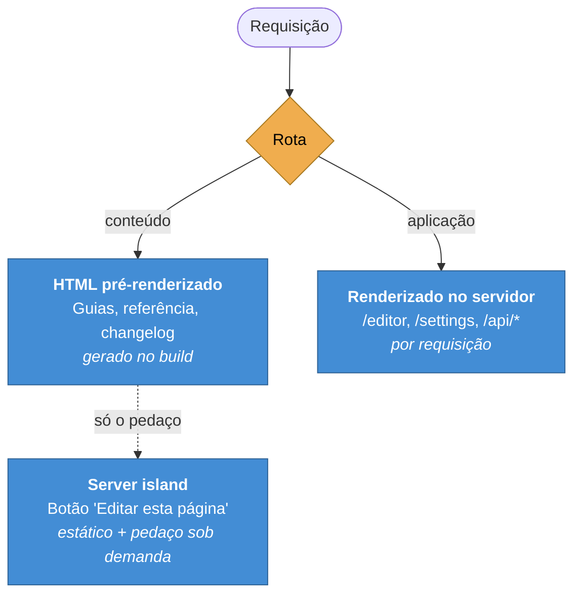

# ADR-0003 — Estático por padrão, servidor onde é preciso

**Status:** Aceita · **Data:** 2025-12 · **Nível C4:** Contêiner

## Contexto

As páginas de documentação são iguais para todo mundo: um guia não muda conforme
quem lê. Servi-las pelo servidor gastaria CPU para produzir sempre o mesmo HTML.

O editor, as telas de administração e as rotas de API são o oposto: dependem de
quem está autenticado, e o HTML precisa mudar por pessoa.

O Astro obriga a escolher um padrão: `output: 'static'` ou `output: 'server'`.

## Decisão

O projeto usa **`output: 'server'`** com **`prerender` forçado nas páginas de
conteúdo** através do hook `astro:route:setup`.

O padrão do framework é servidor; o padrão efetivo do portal é estático, porque
toda rota de documentação é marcada para pré-renderizar.

O caso interessante é o terceiro. A página de documentação é estática, mas o
botão "Editar esta página" só deve existir para quem pode editar. Ele é uma
*server island*: a página inteira vem do cache, e só o botão é resolvido no
servidor.

## Consequências

**O que melhorou.** Páginas de documentação servem do cache, sem custo por
leitor. Um portal público com tráfego alto não paga CPU pelo conteúdo.

**O que custou.** A escolha é por rota, e errar é silencioso nos dois sentidos.
Uma rota que deveria ser dinâmica e ficou estática serve dado velho; uma que
deveria ser estática e ficou dinâmica gasta CPU sem ninguém notar.

O build acusa parte disso: rotas pré-renderizadas que tocam
`Astro.request.headers` geram aviso — o portal tem alguns, e cada um é uma rota
onde a marcação merece revisão.

**O que passou a ser possível.** O botão de editar nunca chega ao HTML de quem
não pode editar. Isso não é o controle de acesso — quem barra é o middleware,
ver [ADR-0006](0006-autorizacao-por-capacidade.md) — mas evita a situação
constrangedora de um botão visível que devolve 403 ao ser clicado.

## Alternativas consideradas

**`output: 'static'` com as rotas dinâmicas num serviço à parte.** Devolveria o
problema que a [ADR-0001](0001-astro-e-starlight.md) resolveu: dois deploys e um
contrato entre eles.

**Tudo no servidor.** Simples de raciocinar e caro de servir. Uma página de guia
não tem nada de dinâmico; renderizá-la a cada leitura é trabalho puro.

**Esconder o botão de editar por CSS ou JavaScript.** Foi descartado porque o
HTML continuaria contendo o botão, e "escondido na interface" não é uma
propriedade de segurança — é uma aparência dela.
