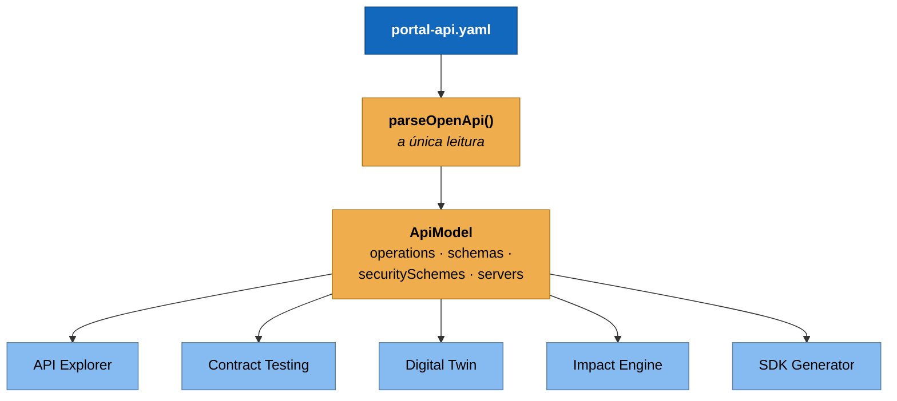

# ADR-0004 — Uma leitura do OpenAPI, muitos consumidores

**Status:** Aceita · **Data:** 2026-02 · **Nível C4:** Componente

## Contexto

Cinco partes do portal precisam entender a especificação OpenAPI:

| Parte | O que ela precisa saber |
| --- | --- |
| API Explorer | Operações, parâmetros, corpo de exemplo, esquemas de segurança |
| Contract Testing | Schemas, campos obrigatórios, códigos de resposta |
| Digital Twin | Endpoints declarados, para cruzar com o código e as páginas |
| Impact Engine | Quais operações mudaram entre duas versões |
| SDK Generator | Tudo acima, mais schemas nomeados |

O caminho natural é cada uma abrir o YAML e ler o que precisa. É o caminho que
parece mais desacoplado, e é o que produz cinco interpretações da mesma
especificação.

## Decisão

**Existe uma função, `parseOpenApi()`, e um tipo, `ApiModel`.** Todos os cinco
consumidores partem dele, e nenhum abre YAML.

Quando um consumidor precisa de algo que o `ApiModel` não carrega, o modelo
ganha o campo — não um parser novo.

## Consequências

**O que melhorou.** Uma correção no parser corrige os cinco consumidores. Um
comportamento estranho tem um lugar para investigar.

Quando o gerador de SDK precisou de `components/schemas` nomeados — que o
Explorer nunca usou —, o `ApiModel` ganhou o campo `schemas`. Dois testes de
fixture quebraram, foram corrigidos, e os cinco consumidores passaram a ver a
mesma coisa.

**O que custou.** O `ApiModel` acumula campos que nem todo consumidor usa. O
`schema` cru de cada resposta existe só para o SDK; o `example` serializado
existe só para o Explorer.

E há acoplamento: mexer no `ApiModel` pode quebrar cinco coisas. É o preço de
não ter cinco verdades — e o typecheck acusa na hora, o que não aconteceria com
cinco parsers independentes.

**O que passou a ser possível.** O SDK pôde ser construído sem escrever nada
sobre a API: `OpenAPI → ApiModel → SdkSpecification → renderer`. O gerador não
sabe o que é YAML.

## Alternativas consideradas

**Cada consumidor com o seu parser.** Foi o que a especificação de SDK
Engineering proibiu explicitamente, e a proibição estava certa: cinco leituras
divergem na primeira vez que alguém corrige um caso de borda em uma delas.

**Uma biblioteca de parsing OpenAPI de terceiros como modelo comum.** Resolveria
o parsing e devolveria o problema do modelo: o tipo da biblioteca descreve o
documento OpenAPI, não o que o portal precisa. Cada consumidor traduziria de
novo — cinco traduções em vez de cinco parsers.

**Gerar código a partir da especificação, em build.** Foi descartado por tornar
o build dependente de uma etapa de geração, e por dificultar o caso em que a
especificação é lida de uma versão anterior do Git — que é justamente o que o
diff de SDK e a análise de impacto fazem.

## Evidência

Duas correções recentes vieram desta decisão:

- O gerador de SDK duplicou a regra de `fallbackOperationId` e a copiou errada:
  operações sem `operationId` viravam `getItemsId` em vez de `get`. A correção
  foi importar a função do parser, não consertar a cópia.
- Uma referência `$ref` precisava ser preservada, não resolvida, para o SDK
  tipar `User` em vez de repetir a forma de `User`. O campo `schema` de cada
  resposta passou a guardar o nó cru, e o Explorer continuou funcionando por não
  usá-lo.
