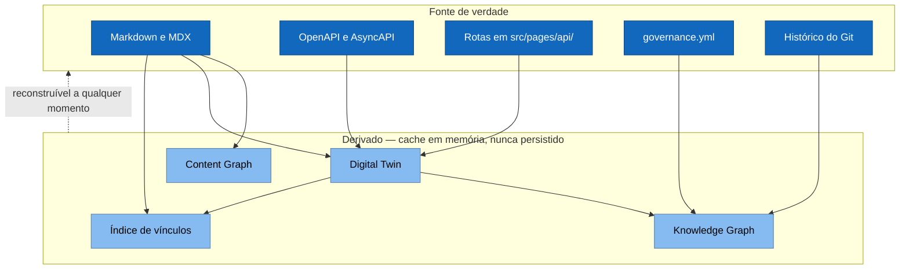

# ADR-0005 — Camadas derivadas nunca são fonte de verdade

**Status:** Aceita · **Data:** 2026-03 · **Nível C4:** Componente

## Contexto

O portal tem quatro estruturas que representam relações entre coisas:

- **Content Graph** — que página usa qual bloco reutilizável.
- **Digital Twin** — o que do produto está documentado, e o que da documentação
  não existe mais no produto.
- **Knowledge Graph** — o Twin mais time, release, lacuna e contrato.
- **Índice de vínculos** do Documentation-to-Code Loop.

Montá-las custa: ler todo o conteúdo, toda a especificação, todo o roteamento de
arquivos. A tentação óbvia é persistir o resultado e atualizá-lo por evento.

Foi a tentação que produziu o pior tipo de defeito que este projeto encontrou em
outras camadas: um número confiante e errado.

## Decisão

**Toda camada de relação é derivada e descartável.** Nenhuma é persistida como
verdade, nenhuma é editável, e nenhuma tem um campo que não possa ser
reconstruído a partir do repositório.

A regra escrita em cada uma delas:

> Se o grafo discordar do repositório, quem está errado é o grafo.

O Knowledge Graph mantém cache em memória com prazo de cinco minutos e **declara
a idade** em toda resposta. Passado o prazo, ele se diz `stale` em vez de
responder como se estivesse novo.

## Consequências

**O que melhorou.** Não existe a categoria de defeito "o índice está
dessincronizado". Um `git checkout` de outra branch muda o grafo na próxima
leitura, sem invalidação, sem migração, sem processo de reindexação.

O Knowledge Graph estende o Twin em vez de duplicá-lo — decisão que a
especificação de P3.4 pedia e que esta ADR já obrigava.

**O que custou.** Reconstruir custa tempo. O Knowledge Graph lê o Twin, a
governança, o Git, o Gap Mining e o Contract Testing; num repositório grande
isso são segundos, não milissegundos.

O cache resolve o caso comum e cria o seu próprio problema: um grafo de cinco
minutos atrás pode não refletir o que acabou de mudar. Por isso ele declara a
idade em vez de escondê-la.

**O que passou a ser possível.** Degradação honesta. Quando uma camada não
carrega — a governança falha, o repositório não tem tags —, o grafo é montado
sem ela e **registra o que faltou**. Um grafo montado sem a governança responde
"ninguém é dono disto" com a mesma confiança de um completo, e essa é a resposta
errada mais fácil de acreditar.

Degradação vence idade: um grafo montado há dez segundos sem uma camada continua
`stale`.

## Alternativas consideradas

**Índice persistido com invalidação por evento.** Mais rápido e sujeito ao
problema clássico: um evento perdido deixa o índice errado, e nada acusa. O
portal grava em disco por várias vias — editor, CLI, agente, `git checkout` — e
cobrir todas com eventos seria cobrir um conjunto aberto.

**Reconstruir a cada requisição, sem cache.** Correto e lento demais para uma
tela que consulta o grafo várias vezes.

**Persistir com verificação de integridade.** Guardar um hash do conteúdo e
reconstruir quando ele mudar. Isso é reconstruir, mais um lugar onde guardar o
hash — a complexidade do índice persistido sem o benefício.
