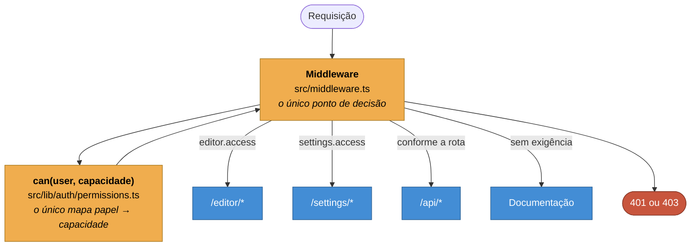

# ADR-0006 — Autorização por capacidade, num middleware só

**Status:** Aceita · **Data:** 2025-12 · **Nível C4:** Componente

## Contexto

O portal tem três papéis — viewer, editor, admin — e superfícies que precisam ser
protegidas: `/editor/*`, `/settings/*` e dezenas de rotas de API.

O jeito direto é perguntar pelo papel onde a decisão acontece:

```ts
if (user.role === 'admin' || user.role === 'editor') { /* … */ }
```

Ele funciona até o dia em que aparece um quarto papel, ou em que "editor" deixa
de poder fazer uma das coisas que fazia. Aí a condição está espalhada por
cinquenta arquivos, e cada um precisa ser encontrado.

## Decisão

Duas regras.

**O código pergunta por capacidade, nunca por papel:**

```ts
if (can(user, 'users.update')) { /* … */ }
```

O mapa de papel para capacidades vive num lugar só, em
`src/lib/auth/permissions.ts`.

**Um único middleware protege todas as superfícies.** Ele roda antes de
qualquer rota e decide com base na capacidade exigida por aquele caminho.



As rotas de API repetem a checagem no início do handler. Não por desconfiança do
middleware, mas porque uma rota que confia apenas nele fica insegura no dia em
que alguém a move para fora do caminho protegido.

## Consequências

**O que melhorou.** Acrescentar um papel é editar uma tabela. Mudar o que um
papel pode fazer é editar uma linha. Nenhuma dessas mudanças exige encontrar
condicionais espalhadas.

Auditar o que um papel alcança é ler um arquivo, não varrer o código.

**O que custou.** Uma indireção. Ler `can(user, 'users.update')` não diz quem
pode — é preciso abrir a tabela. Em troca, a tabela é a resposta completa, o que
a leitura direta do papel nunca é.

**O que passou a ser possível.** As proteções contra escalação de privilégio e
contra remoção do último administrador puderam ser escritas num lugar só, sobre
capacidades, em vez de replicadas em cada rota que mexe em usuário. Detalhes em
[docs/controle-de-acesso.md](../controle-de-acesso.md).

## Alternativas consideradas

**Checar o papel na rota.** Descartado pelo motivo do contexto: a regra se
espalha e diverge.

**Permissões por registro, no banco.** Escala para produtos multi-inquilino e
seria peso morto aqui: a documentação é pública, e a granularidade de que o
portal precisa é o caminho da URL, não a linha da tabela.

**Confiar só no botão escondido.** O botão "Editar esta página" não aparece para
viewer — mas quem barra é o middleware. Esconder o botão é cortesia com a
interface, e a decisão de acesso não pode morar ali. Ver
[ADR-0003](0003-renderizacao-hibrida.md).
