# ADR-0007 — Estado operacional fora do Git

**Status:** Aceita · **Data:** 2025-12 · **Nível C4:** Contêiner

## Contexto

A [ADR-0002](0002-git-como-fonte-de-verdade.md) coloca o conteúdo no Git. Mas o
portal também produz estado que **não** é conteúdo:

- hash de senha, token de sessão, chave HMAC;
- trilha de auditoria;
- telemetria de leitura e de busca;
- snapshots de saúde, corridas de avaliação, histórico de self-healing;
- workspaces isolados dos agentes.

Aplicar a regra do conteúdo a tudo isso colocaria credenciais no repositório.

## Decisão

**Estado operacional vive em `data/`, que é ignorado pelo Git.** Conteúdo vive
em `src/content/`, versionado.

A fronteira é uma pergunta: *isto deveria aparecer num pull request?*

```mermaid
flowchart TB
    subgraph versionado["Versionado no Git"]
        direction TB
        conteudo["src/content/<br/><i>Markdown, MDX, glossário, snippets</i>"]
        config["*.yml na raiz<br/><i>governance, health, contracts,<br/>twin, sdk, selfhealing</i>"]
        evals["evals/<br/><i>Conjuntos de avaliação</i>"]
        sdk["generated/<br/><i>SDK gerado</i>"]
    end

    subgraph efemero["data/ — ignorado pelo Git"]
        direction TB
        auth["users.json · sessions.json · secret<br/><i>hash, token, chave HMAC</i>"]
        audit["audit.json<br/><i>trilha de auditoria</i>"]
        tel["observability.json · gap-telemetry.json<br/><i>telemetria agregada</i>"]
        estado["health-snapshots · ai-evaluations · healing<br/><i>séries e histórico</i>"]
        ws["agent-workspaces/<br/><i>rascunhos isolados</i>"]
    end

    classDef v fill:#438dd5,stroke:#2e6295,color:#fff
    classDef e fill:#f0ad4e,stroke:#a8791f,color:#000
    class conteudo,config,evals,sdk v
    class auth,audit,tel,estado,ws e
```

A configuração fica **versionada**, e isso é deliberado: um alvo de qualidade é
um acordo da equipe, e acordo que só existe na tela de alguém não sobrevive à
troca de time. O mesmo vale para os conjuntos de avaliação de IA e para o SDK
gerado — este último é o que permite ao `sdk check` detectar SDK fora de
sincronia num clone limpo.

## Consequências

**O que melhorou.** Nenhuma credencial vai para o repositório. Um clone público
do portal não carrega usuários nem telemetria.

`PORTAL_DATA_DIR` move o diretório inteiro, o que permite subir uma instância de
verificação sem tocar nos dados reais.

**O que custou.** `data/` não é replicado. Rodar duas réplicas do portal exige
armazenamento compartilhado, e sem `AUTH_SECRET` no ambiente cada réplica gera a
sua chave — as sessões de uma não valem na outra.

Não há backup automático. Perder o volume perde usuários e auditoria; o conteúdo
sobrevive porque está no Git.

Escrita concorrente é resolvida com escrita atômica e trava por arquivo em
processo — o que basta para um processo e não para vários.

**O que passou a ser possível.** A telemetria pôde ser projetada com retenção
aplicada **na escrita** e um comando de apagar tudo, sem que nada disso
precisasse mexer em histórico de Git — que não esquece.

## Alternativas consideradas

**Tudo no Git, com `data/` versionado e segredos por variável de ambiente.** O
hash de senha continuaria no repositório. Hash não é senha, mas é material para
ataque offline, e não há motivo para publicá-lo.

**Banco de dados para o estado operacional.** Resolveria replicação e backup, e
acrescentaria um serviço externo ao caminho crítico do login — contra
[ADR-0016](0016-degradacao-em-vez-de-dependencia.md). Continua sendo a evolução
natural se o portal precisar de várias réplicas.

**Estado em memória.** Sessões sobreviveriam ao processo e nada mais. Auditoria
que some no restart não é auditoria.
