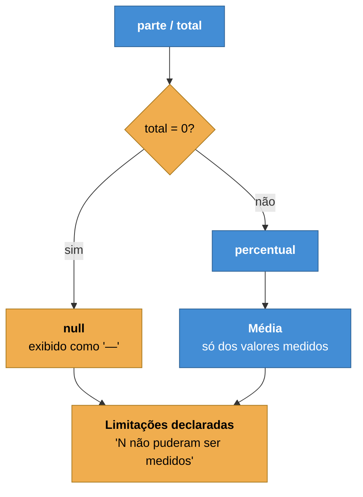

# ADR-0008 — Não medido é `null`, nunca zero

**Status:** Aceita · **Data:** 2026-04 · **Nível C4:** Componente

## Contexto

O portal calcula dezenas de percentuais: cobertura de endpoints, consistência de
vínculos, taxa de clique na busca, conformidade de revisão, groundedness da IA,
saúde por dimensão.

Todos têm o mesmo formato — parte sobre total — e todos encontram o mesmo caso:
**o total é zero**.

Um portal sem busca não tem 0% de sucesso na busca. Um portal sem vínculo de CLI
não tem 0% de consistência de CLI. Uma release que não mexeu em entidade
mensurável não tem 0% de cobertura.

Devolver `0` nesses casos produz um número que parece uma medição e é a ausência
dela. Pior: ele desce a média, e a média desce a nota, e a nota aciona um alerta
sobre algo que não aconteceu.

## Decisão

**Denominador zero devolve `null`.** A interface mostra `—`, e o texto diz por
quê.

`null` nunca entra numa média: a média é dos valores medidos, e o relatório
informa quantos ficaram de fora.

A regra se estende a três casos vizinhos:

- **Validação que não rodou** vale `null`, e `null` nunca conta como aprovação.
- **Falha de execução** não é reprovação: rede fora não é falha do agente.
- **Sem base de comparação** é `unavailable`, e não "nenhuma mudança".

## Consequências

**O que melhorou.** Nenhum alerta dispara por ausência de dado. Um portal recém
instrumentado não aparece como portal ruim.

**O que custou.** Todo tipo que carrega percentual é `number | null`, e todo
consumidor precisa tratar os dois. É verbosidade real, espalhada por muitos
arquivos.

Uma tela com muitos `—` parece incompleta. Ela está — e a alternativa era parecer
completa e estar errada.

**O que passou a ser possível.** Comparações honestas. O diff de avaliação de IA
declara duas corridas **incomparáveis** quando uma rodou com modelo e a outra
não, em vez de reportar uma queda de 40 pontos que só reflete a ausência de uma
chave de API.

## Alternativas consideradas

**Devolver `0`.** É o padrão que a maioria das ferramentas adota, e é o que
produz o defeito que esta ADR evita.

**Devolver `100`.** Otimista e pior: um portal sem nenhum vínculo de CLI
apareceria com consistência perfeita de CLI.

**Omitir a linha.** Esconde o que não foi medido, e a soma passa a não bater com
o total sem explicação. Mostrar `—` é a mesma informação, visível.

## Evidência

Quatro defeitos reais, todos corrigidos por esta regra:

- **Cobertura de lacunas sempre 100%.** O BM25 normaliza pela melhor
  correspondência, então toda consulta parecia coberta. Passou a medir presença
  dos termos na página.
- **"Segurança 100%" na avaliação de IA** somando casos que não testam
  segurança. Um caso sem termo proibido e sem expectativa de recusa passou a
  devolver "não medido".
- **Sucesso do leitor zerando a saúde** num portal recém instrumentado. Sem
  volume, ele é `null`, e a saúde combinada também.
- **Cobertura de release 0%** numa release que não tocou entidade mensurável.
