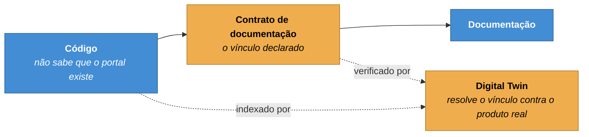

# ADR-0009 — O vínculo com o produto vive no frontmatter

**Status:** Aceita · **Data:** 2026-06 · **Nível C4:** Componente

## Contexto

Para saber que documentação uma mudança de código afeta, é preciso que exista um
vínculo declarado entre página e entidade do produto. A alternativa — inferir do
texto — não funciona: uma frase que cita `POST /api/payments` não documenta o
endpoint, e tratar menção como documentação produz cobertura fictícia.

O vínculo pode ser declarado de dois lados:

- **No código**, como anotação: `// @documented-by docs/payments.md`
- **Na documentação**, como frontmatter: `documentation.bindings`

## Decisão

**O vínculo vive no frontmatter da documentação, nunca no código.**

```yaml
---
title: Pagamentos
documentation:
  bindings:
    - type: api
      id: POST /api/payments
---
```

A direção de dependência é fixa:



Cada vínculo é **resolvido contra o Digital Twin**. Um identificador escrito à
mão que não corresponde a nada existente não conta como cobertura: ele aparece
marcado, com o motivo.

## Consequências

**O que melhorou.** O produto não depende de Markdown. Um `git mv` de uma página
não quebra o build de nada.

Cobertura passou a significar algo verificável: das entidades públicas, quantas
têm vínculo declarado **e resolvido**. No portal, isso foi de 6% para 100% ao
longo do trabalho — e as 8 de 8 são reais, não menções.

**O que custou.** O vínculo é manual. Ninguém é obrigado a declará-lo, e uma
página pode documentar um endpoint sem dizer que o documenta. É o que a lista de
"entidades sem vínculo declarado" existe para mostrar.

E o vínculo pode apodrecer no sentido oposto: apontar para algo que não existe
mais. Esses aparecem como **potencialmente** órfãos — a página pode documentar
comportamento histórico ou uma versão anterior, e um veredito automático
transformaria documentação legítima em alarme.

**O que passou a ser possível.** O portão de CI que bloqueia quando uma entidade
pública muda sem página vinculada, e o impacto documental que aponta quais
páginas revisar num pull request.

## Alternativas consideradas

**Anotação no código.** Inverteria a direção: renomear um arquivo Markdown
passaria a quebrar o build do produto. Nenhuma equipe aceita isso, e a primeira
reação seria remover as anotações.

**Inferir por menção de texto.** Barato e falso. Foi explicitamente proibido pela
especificação, e a proibição estava certa.

**Arquivo central de mapeamento.** Um `bindings.yml` com todas as relações. Foi
descartado por ficar longe do que ele descreve: quem move uma página não lembra
de editar um arquivo na raiz, e o mapa envelhece calado. No frontmatter, o
vínculo viaja com a página.

## Evidência

O primeiro relatório sobre o repositório real marcou **todos** os endpoints de
`portal-api.yaml` como alterados porque o arquivo fora tocado. Corrigir uma
palavra num `summary` bloqueava o merge por quatro endpoints que ninguém tocou.

A correção cruza as linhas que o Git reporta como alteradas com as faixas de
cada operação — o vínculo é por operação, não por arquivo.
