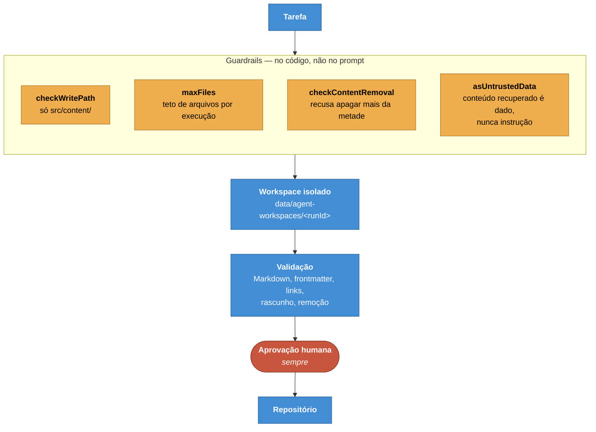

# ADR-0010 — Guardrails de agente por construção

**Status:** Aceita · **Data:** 2026-07 · **Nível C4:** Componente

## Contexto

O portal tem agentes que redigem documentação e um ciclo de self-healing que os
aciona. Isso significa software que gera texto e o grava em arquivos que outras
pessoas leem como verdade.

O risco não é teórico. Na primeira execução real, o agente redator **substituiu
uma página inteira de autenticação por um esqueleto** — e o esqueleto passou pela
revisão, pelos testes e pela auditoria, porque um esqueleto bem formado é
Markdown válido.

Nenhuma das três verificações estava errada. Elas verificavam se o resultado era
válido, e ele era. O que faltava era alguém perguntar se o resultado ainda era a
mesma página.

## Decisão

**Todo limite é estrutural, não uma instrução no prompt.**

A distinção é a decisão inteira: um limite escrito no prompt é um pedido; um
limite no código é uma impossibilidade.

Cinco coisas o ciclo **não consegue** fazer:

| Não faz | Por que não consegue |
| --- | --- |
| Inventar fatos | O diagnóstico recusa sem fonte autoritativa |
| Alterar código | A política de caminho só permite `src/content/` |
| Escolher entre fontes que discordam | Conflito vira lacuna para intervenção humana |
| Mascarar falha de validação | Validação que não rodou vale `null`, nunca aprovação |
| Fazer merge | Nenhum nível de autonomia faz merge |

O nível padrão de autonomia é 3 — detectar, redigir, validar, abrir PR. O nível
4, merge automático, existe no modelo e não é ligado por padrão em circunstância
nenhuma.

## Consequências

**O que melhorou.** O agente redigiu propostas reais neste repositório e o
`git status` continuou limpo em todas. Não por disciplina: porque o caminho de
escrita não alcança o repositório.

Uma verificação contra caminhos hostis — `data/users.json`,
`src/lib/auth/permissions.ts`, `astro.config.mjs`, `../../../fora.md`,
`src/content/docs/../../../data/users.json` — recusou todos.

**O que custou.** Autonomia baixa. O ciclo produz propostas e para; alguém
precisa revisar cada uma. Num portal com muitas lacunas isso é uma fila.

A checagem de remoção tem falso positivo: uma reescrita legítima que corta
metade de uma página é bloqueada e exige revisão humana. É o lado certo do erro.

**O que passou a ser possível.** Ligar o self-healing sem que a pergunta "e se
ele estragar tudo?" precise de uma resposta de confiança. A resposta é
estrutural.

## Alternativas consideradas

**Instruir o modelo a não fazer.** É o que quase todo produto de agente faz, e é
o que falha silenciosamente. O modelo que destruiu a página tinha instrução para
não destruir páginas.

**Revisar por outro modelo.** Foi tentado e é insuficiente: revisão, teste e
auditoria aprovaram o esqueleto. Um modelo julgando outro modelo aprova o que é
plausível, e um esqueleto é plausível.

**Escrever direto com `git revert` como rede.** Reverter exige alguém notar. O
problema do esqueleto foi exatamente ninguém notar até uma inspeção manual.

## Evidência

As duas correções que nasceram do incidente:

- **`appendEvidenceSection`** — quando não há modelo e a página existe, a
  atualização é aditiva. Nunca substituição.
- **`checkContentRemoval`** — recusa qualquer alteração que remova mais da
  metade do conteúdo, independentemente de o texto ter vindo de um modelo ou não.

Duas outras vieram da primeira proposta de self-healing, meses depois: a
validação aprovava um frontmatter quebrado, e aprovava um texto que continha o
marcador `ESCREVER: sem evidência suficiente` — o próprio redator dizendo que
faltava evidência.
