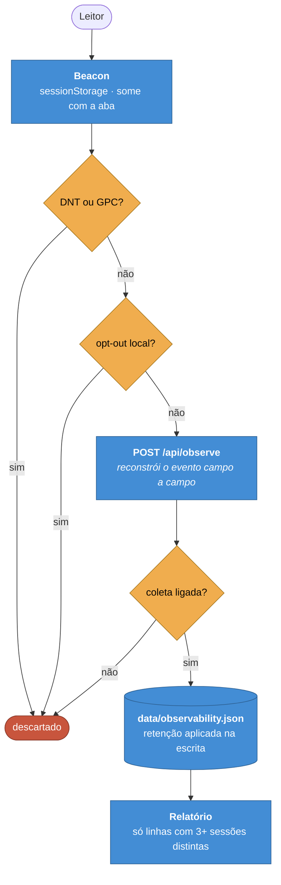

# ADR-0011 — Telemetria de leitura sem identidade

**Status:** Aceita · **Data:** 2026-07 · **Nível C4:** Componente

## Contexto

Medir se a documentação resolve o problema de quem chegou exige observar
leitores: que páginas abrem, o que buscam, onde param.

Toda ferramenta de analytics resolve isso guardando um identificador por pessoa
— cookie persistente, fingerprint, id de usuário. É o que permite responder
"quantas pessoas distintas" e "o que esta pessoa fez depois".

A segunda pergunta é a que cria o problema. Um portal de documentação de API
recebe engenheiros de clientes; saber que uma pessoa específica leu a página de
migração três vezes é informação sobre um cliente que ninguém pediu para
coletar.

## Decisão

**O evento não tem onde guardar quem é a pessoa.**

Não é uma política aplicada na consulta: é a forma do tipo.

```ts
interface ObservedEvent {
  type: ObservedEventType;
  path?: string;
  session: string;   // efêmera, do navegador
  at: number;        // arredondado para o minuto
  results?: number;
  dwellSeconds?: number;
  query?: string;    // só quando explicitamente ligado
  vote?: 'up' | 'down';
}
```

Sem IP, sem id de usuário, sem cookie persistente, sem user-agent, sem referrer.



Quatro reforços:

1. **A sessão vive em `sessionStorage`** — some quando a aba fecha, e nunca liga
   duas visitas.
2. **A rota reconstrói o evento campo a campo**, em vez de gravar o corpo
   recebido. Se alguém acrescentar `email` ao beacon amanhã, ele é descartado
   ali.
3. **Limiar de agregação**: uma linha só aparece com três sessões distintas. Com
   uma, "quem leu esta página" pode ser uma pessoa identificável para quem
   conhece a equipe.
4. **Retenção aplicada na escrita**, não por processo de limpeza. Um processo que
   alguém precisa lembrar de rodar é um processo que não roda.

O texto das buscas fica **desligado por padrão** — a mesma chave que o resto do
portal já respeita.

## Consequências

**O que melhorou.** Não há dado sensível a proteger, porque não há dado
sensível. Um vazamento do `data/` expõe contagens.

Do Not Track e Global Privacy Control são honrados no cliente e de novo no
servidor.

**O que custou.** Perguntas legítimas ficam sem resposta: "quantas pessoas
distintas leram este mês" não é respondível — só "quantas sessões". Retorno de
leitor, coorte e funil por pessoa também não.

Com o texto desligado, uma lacuna de busca aparece sem nome. O relatório diz
isso e qual chave ligar, em vez de omitir a lacuna.

**O que passou a ser possível.** Ligar a observabilidade por padrão. Uma camada
que guardasse identidade precisaria vir desligada, e uma camada desligada não
mede nada.

## Alternativas consideradas

**Cookie com id anônimo.** "Anônimo" dura até o primeiro cruzamento com outra
fonte. E exigiria banner de consentimento, o que reduziria o dado ao subconjunto
de quem clica em aceitar.

**Hash do IP com sal rotativo.** Melhor que IP cru e ainda um identificador —
estável dentro da janela do sal, e reversível para quem tem o sal e a lista de
IPs.

**Não medir nada.** Foi o estado anterior, e ele deixa o portal sem resposta
para "isto está ajudando alguém?". As três lacunas que a camada encontrou no
primeiro dia justificaram medir.

## Evidência

Verificação contra o servidor real, com pedidos hostis:

| Tentativa | Resultado |
| --- | --- |
| Travessia de caminho em `path` | Recusada, evento descartado |
| Sessão malformada | `400` |
| Cabeçalho `DNT: 1` | Aceito e não gravado |
| Campos `email` e `ip` no corpo | Nunca chegaram ao disco |
