# ADR-0012 — Portões de CI bloqueiam pouco, de propósito

**Status:** Aceita · **Data:** 2026-06 · **Nível C4:** Dinâmico

## Contexto

O portal tem sete verificações que rodam na revisão de pull request: linter,
testes de documentação, cobertura do Digital Twin, contratos, saúde, vínculo com
o código e impacto no SDK.

Cada uma pode bloquear o merge. Se todas bloquearem, o resultado previsível é
alguém desligar o conjunto — e um portão desligado não verifica nem o que
importava.

O problema não é técnico. É que a autoridade de um portão vem de ele estar certo
quando dispara, e um portão que dispara por ruído gasta essa autoridade.

## Decisão

**Só bloqueia o que torna algo publicado falso ou quebra alguém fora deste
repositório.** O resto avisa.

```mermaid
flowchart TB
    pr["<b>Pull request</b>"]

    subgraph bloqueia["Bloqueia o merge"]
        direction TB
        b1["Contrato quebrado<br/><i>o exemplo publicado está errado</i>"]
        b2["Entidade pública sem página vinculada<br/><i>tipo obrigatório pela política</i>"]
        b3["Mudança incompatível de SDK<br/><i>quebra o build de quem instalou</i>"]
        b4["Mudança incompatível sem guia de migração"]
        b5["Quality gate abaixo do mínimo"]
    end

    subgraph avisa["Avisa e deixa passar"]
        direction TB
        a1["Página vinculada não atualizada junto"]
        a2["SDK fora de sincronia"]
        a3["Revisão vencida ou nunca feita"]
        a4["Saúde em queda sem violar SLO"]
        a5["Entidade não obrigatória sem página"]
        a6["Exemplo potencialmente obsoleto"]
    end

    pr --> bloqueia
    pr --> avisa

    classDef b fill:#c8553d,stroke:#8c3b2b,color:#fff
    classDef a fill:#f0ad4e,stroke:#a8791f,color:#000
    classDef p fill:#438dd5,stroke:#2e6295,color:#fff
    class b1,b2,b3,b4,b5 b
    class a1,a2,a3,a4,a5,a6 a
    class pr p
```

Três consequências da mesma regra:

- **Revisão vencida não derruba a CI por padrão** (`failOnExpired: false`). Um
  portão que bloqueia merge por documentação que envelheceu sozinha é o primeiro
  a ser desligado.
- **Falhar em executar não é aprovar, e também não bloqueia.** Um erro de
  execução travando todo merge é como se desliga um portão para sempre.
- **Variação pequena não é regressão.** Na avaliação de IA, abaixo de 5 pontos
  percentuais a diferença é ruído de recuperação — exceto em segurança, onde
  qualquer queda conta.

## Consequências

**O que melhorou.** Os portões que bloqueiam são poucos e defensáveis. Quando um
dispara, a conversa é sobre o problema, não sobre desligar a verificação.

**O que custou.** Coisas reais passam. Um SDK fora de sincronia entra no merge,
e quem clonar depois precisa rodar o gerador. Uma página defasada é publicada
com aviso e sem impedimento.

A aposta é que um aviso lido vale mais que um bloqueio contornado — e ela pode
estar errada numa equipe que não lê avisos.

**O que passou a ser possível.** Ligar todos os sete portões ao mesmo tempo. Uma
configuração em que qualquer um deles bloqueia teria sido revertida na primeira
semana.

## Alternativas consideradas

**Bloquear tudo.** Mais seguro no papel e insustentável na prática. A pergunta
não é o que seria bom bloquear, é o que a equipe tolera bloqueando.

**Bloquear nada, só reportar.** Vira relatório que ninguém abre. Contrato
quebrado é exemplo publicado errado — merece parar o merge.

**Deixar cada equipe configurar.** Existe: `failOnViolation`, `failOnStale` e
`failOnExpired` são configuráveis. A decisão aqui é sobre o **padrão**, que é o
que quase todo mundo mantém.

## Evidência

Dois casos em que o padrão errado apareceu antes de ser corrigido:

- **Rotas internas bloqueando merge.** As rotas do editor e da administração são
  declaradas internas no `twin.yml`, e o Code Loop as cobrava: toda mudança no
  editor bloqueava o merge por endpoints que ninguém publica.
- **27 páginas "atrasadas" no primeiro dia.** A governança somava "vencida" e
  "nunca revisada". No dia em que o regime entrou, nada tinha atrasado — só nunca
  tinha começado.
