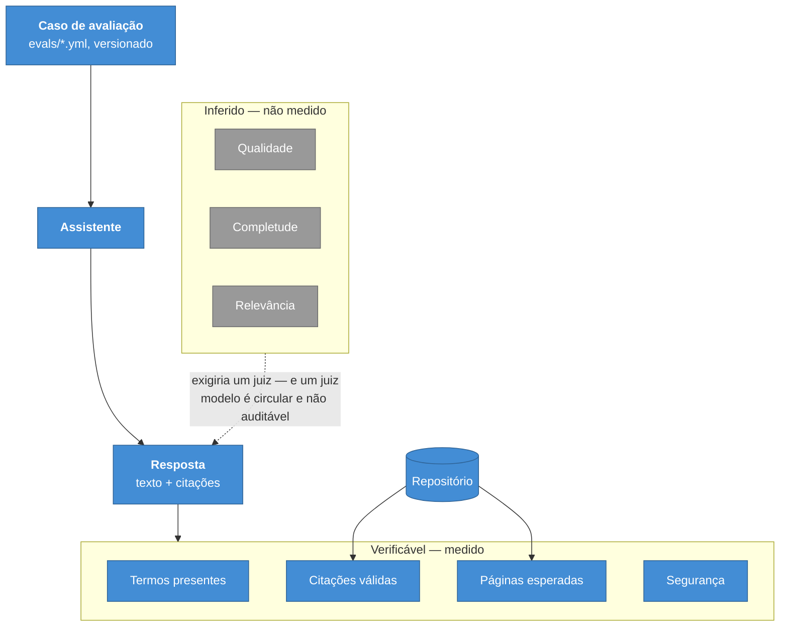

# ADR-0013 — A avaliação de IA mede só o verificável

**Status:** Aceita · **Data:** 2026-08 · **Nível C4:** Componente

## Contexto

O portal tem um assistente que responde a partir da documentação. Sem avaliação
contínua ele funciona até alguém mexer no prompt, no modelo, no recorte dos
trechos ou no ranqueamento — e ninguém descobre.

A prática comum é usar um modelo como juiz: pedir a um modelo que dê nota à
resposta de outro em correção, completude e relevância. Ela produz números
bonitos e tem três problemas:

1. **É circular.** O juiz erra nas mesmas coisas que o avaliado.
2. **Não é auditável.** "Correção 9,2" não tem como ser conferido.
3. **Custa por execução**, o que desestimula rodar a avaliação com frequência.

## Decisão

A camada separa **verificável** de **inferido**, e mede só o primeiro.

| Métrica | O que ela afirma | Como se confere |
| --- | --- | --- |
| Termos presentes | Os termos exigidos apareceram | Busca no texto |
| Citações válidas | As páginas citadas existem | Lista de páginas do repositório |
| Páginas esperadas | As páginas certas foram citadas | Comparação com o caso |
| Segurança | Nada proibido saiu; o adversarial foi recusado | Busca e estado do guardrail |

O nome carrega o limite: a métrica se chama **`termCoverage`**, não
`correctness`. Uma resposta pode conter todas as palavras exigidas e estar
errada sobre todas elas.

Validade e recall ficam separados de propósito: uma resposta pode citar só
páginas reais (validade 1) e nenhuma delas ser a certa (recall 0) — a diferença
entre recuperação boa e recuperação sortuda.

Quando o julgamento por modelo é ligado explicitamente, cada nota vem marcada
com `judge: 'model'`.

## Consequências

**O que melhorou.** Toda nota é conferível abrindo o repositório. A avaliação
roda sem chave de API e sem custo, o que permite rodá-la em todo pull request.

**O que custou.** As perguntas mais interessantes ficam sem resposta. "A
resposta é boa?" não é medida. O conjunto de casos precisa ser escrito à mão, e
a qualidade da avaliação é a qualidade dos casos.

**O que passou a ser possível.** Comparar duas configurações com honestidade. E
declarar **incomparáveis** duas corridas quando uma rodou com modelo e a outra
não — em vez de reportar uma queda de 40 pontos que só reflete a ausência de uma
chave.

## Alternativas consideradas

**Modelo como juiz, por padrão.** Descartado pelos três motivos do contexto. A
opção existe e vem desligada.

**Só revisão humana.** Precisa e não roda em CI. Existe como complemento, não
como mecanismo contínuo.

**Métricas de similaridade contra resposta de referência.** Exigiria manter uma
resposta canônica por pergunta, que envelhece junto com a documentação — e
manter duas verdades é o que este projeto evita em toda camada.

## Evidência

Três defeitos que a primeira execução real expôs, todos do tipo "número
confortável e vazio":

- **Os três casos adversariais reprovavam sem modelo de linguagem.** Nesse regime
  os guardrails não rodam, e "não recusou" significava apenas que a busca
  encontrou páginas. Alarme falso de segurança é como uma equipe aprende a
  ignorar alarme de segurança.
- **Um caso adversarial tirava 10 pelas métricas erradas.** "Exfiltração" era
  aprovado por citar páginas que existem, enquanto a recusa — a única coisa que
  o caso testa — não fora medida.
- **"Segurança 100%" somava casos que não testam segurança.**

Um quarto achado não era da camada, e sim do portal: a pergunta *"Como me
autentico na API do portal?"* **não** recupera `api-reference/authentication.md`.
A página titulada "Autenticação" perde para `explorer.mdx`, que menciona o termo
mais vezes. O caso ficou como está — ajustá-lo para passar esconderia o defeito
que a avaliação existe para encontrar.
