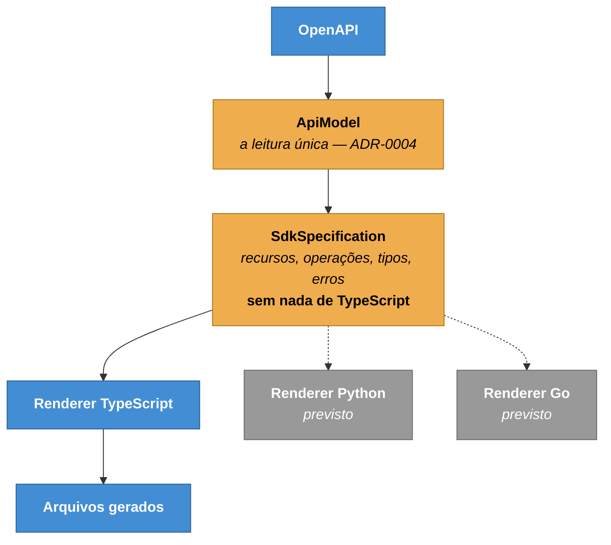

# ADR-0014 — SDK com modelo intermediário e renderer plugável

**Status:** Aceita · **Data:** 2026-08 · **Nível C4:** Componente

## Contexto

O portal gera um cliente TypeScript a partir da especificação OpenAPI. O MVP é
uma linguagem, e Python e Go estão previstos.

O caminho mais curto é escrever o gerador de TypeScript direto sobre o
`ApiModel`: ler operações e imprimir código. Funciona, e faz o gerador de
TypeScript virar a definição do modelo — quando Python chegar, ou ele copia as
decisões de nomeação, ou as reimplementa diferente.

Duas linguagens com nomes diferentes para a mesma API obrigam quem lê a
documentação a aprender duas APIs.

## Decisão

Três camadas, com o modelo intermediário no meio:



As decisões de **nomeação e agrupamento** ficam no modelo, não no renderer: a
tag decide o recurso, o `operationId` decide o método perdendo o prefixo do
recurso, e a colisão de nomes é desambiguada e registrada como limitação.

O renderer é uma interface:

```ts
interface SdkRenderer {
  language: string;
  render(specification: SdkSpecification): GeneratedFile[];
}
```

Acrescentar Python é implementar isso e registrar o renderer. Nada em `build.ts`
muda.

## Consequências

**O que melhorou.** O renderer não lê disco, não conhece OpenAPI e não sabe onde
o SDK será escrito — o que o torna testável sem sistema de arquivos.

`client.users.create()` será o mesmo nome em qualquer linguagem, porque o nome
foi decidido antes do renderer.

**O que custou.** Uma camada a mais para atravessar quando algo está errado no
código gerado: o defeito pode estar no parser, no modelo ou no renderer.

E o modelo é o denominador comum: um recurso idiomático de uma linguagem que não
existe nas outras não tem onde morar. Genéricos de TypeScript, por exemplo,
teriam de entrar como conceito no modelo ou ficar de fora.

**O que passou a ser possível.** O diff de SDK deriva **do contrato**, não da
comparação textual dos arquivos gerados: trocar a indentação do gerador mudaria
todo arquivo e nenhum contrato.

E o pacote gerado não tem dependência de execução — o runtime é `fetch`,
montagem de URL, cabeçalhos, tempo limite e erros. Um SDK que arrasta uma
biblioteca HTTP transfere para quem instala um problema de versão que ele não
escolheu ter.

## Alternativas consideradas

**Gerador direto sobre o `ApiModel`.** Mais curto e faz o primeiro renderer
virar a especificação implícita do segundo.

**Ferramenta de terceiros — OpenAPI Generator, Fern.** Resolvem geração e não
resolvem o resto: o SDK precisa entrar no Impact Engine, na governança e no
portão de CI deste portal. Uma ferramenta externa devolveria arquivos, não
participação.

**Templates em vez de código.** Um motor de template por linguagem. Foi
descartado porque a lógica de tipos — `$ref` preservado, união de enum,
`unknown` para o que a especificação não diz — é código, e código dentro de
template é a pior forma de ambos.

## Evidência

Dois defeitos da primeira geração real, ambos no renderer e nenhum no modelo —
o que é o sinal de que a separação está no lugar certo:

- **O exemplo gerado fechava o próprio JSDoc.** Um corpo obrigatório produzia
  `body: { /* … */ }` dentro de um bloco de comentário; o terminador encerrava o
  bloco e o resto virava código. O SDK não compilava.
- **A tag `autenticação` virava o recurso `autenticaO`** — acento tratado como
  separador na conversão de caixa.

Um terceiro veio do modelo e confirmou a [ADR-0004](0004-uma-leitura-do-openapi.md):
a regra de `fallbackOperationId` fora duplicada e copiada errada.
