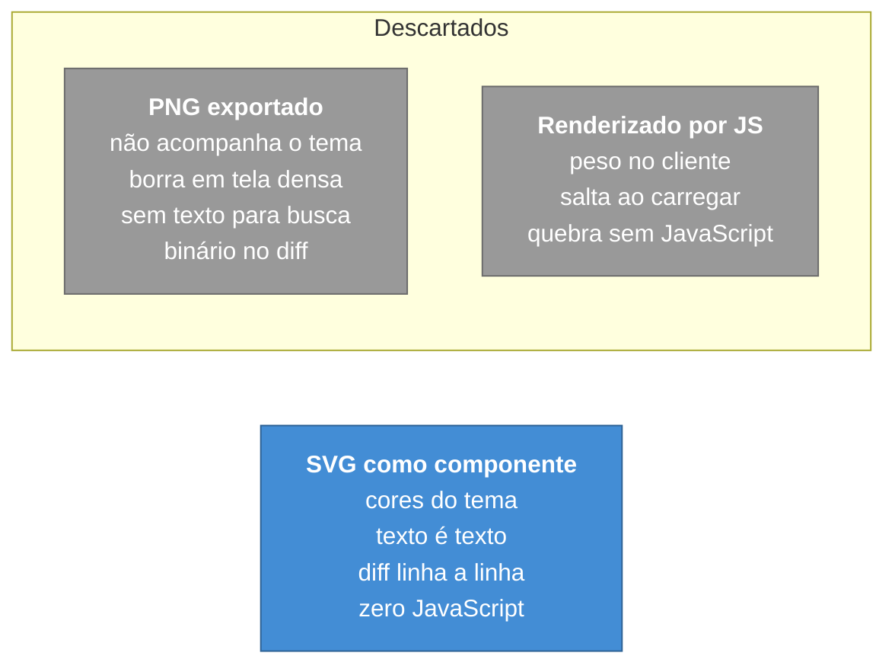

# ADR-0015 — Diagramas como SVG versionado, não imagem

**Status:** Aceita · **Data:** 2026-01 · **Nível C4:** Componente

## Contexto

Documentação técnica precisa de diagramas de caixas e setas. Há três caminhos:

1. **Imagem exportada** de uma ferramenta de desenho — PNG ou SVG binário.
2. **Diagrama renderizado por JavaScript** no cliente — Mermaid, PlantUML.
3. **SVG escrito à mão**, como componente do próprio projeto.

O primeiro resolve o primeiro dia e cobra depois.

## Decisão

**No portal publicado, diagrama é componente Astro com SVG escrito à mão**, em
`src/components/docs/`.

O portal **não** tem integração Mermaid, e a ausência é deliberada.



**Nos documentos de `docs/`, Mermaid é aceito** — inclusive nesta ADR. A
diferença é o contexto: `docs/` é lido no GitHub, que renderiza Mermaid no
servidor. Nenhum leitor do portal paga por isso.

## Consequências

**O que melhorou.** As cores vêm das variáveis do tema, então o diagrama
acompanha claro e escuro. O texto é texto: a busca o encontra e um leitor de
tela o anuncia. A alteração aparece no diff linha a linha, e um revisor consegue
julgá-la num pull request.

**O que custou.** Escrever coordenadas à mão. Para caixas e setas é um custo
pequeno; para um diagrama denso, não é.

O custo aparece na prática: as páginas de exemplo foram escritas com blocos
```mermaid, que renderizaram como **código-fonte** para o leitor. Foram
convertidas para diagramas em texto — que é o terceiro recurso que o portal usa,
e o que sobrevive a tema, zoom, busca e leitor de tela sem custo de autoria.

**O que passou a ser possível.** Nenhum binário no repositório de conteúdo.
Ninguém revisa a mudança de um PNG num pull request — só vê que "a imagem
mudou".

## Alternativas consideradas

**Mermaid no portal.** Resolveria o custo de autoria e traria JavaScript ao
cliente, um salto de layout ao carregar, e um diagrama que some sem JavaScript.
Para um portal cuja proposta inclui funcionar sem depender de nada
([ADR-0016](0016-degradacao-em-vez-de-dependencia.md)), é caro.

**Mermaid renderizado em build, para SVG.** Tecnicamente próximo do resultado
desejado, e acrescenta uma dependência de build — `rehype-mermaid` puxa um
navegador headless. Continua sendo a evolução natural se o volume de diagramas
crescer.

**PNG.** Descartado pelos quatro motivos do diagrama acima.

## Nota

Esta ADR explica por que os diagramas **deste diretório** usam Mermaid enquanto
o portal não usa. Os dois contextos têm leitores e custos diferentes, e a
decisão é sobre o custo de quem lê.
