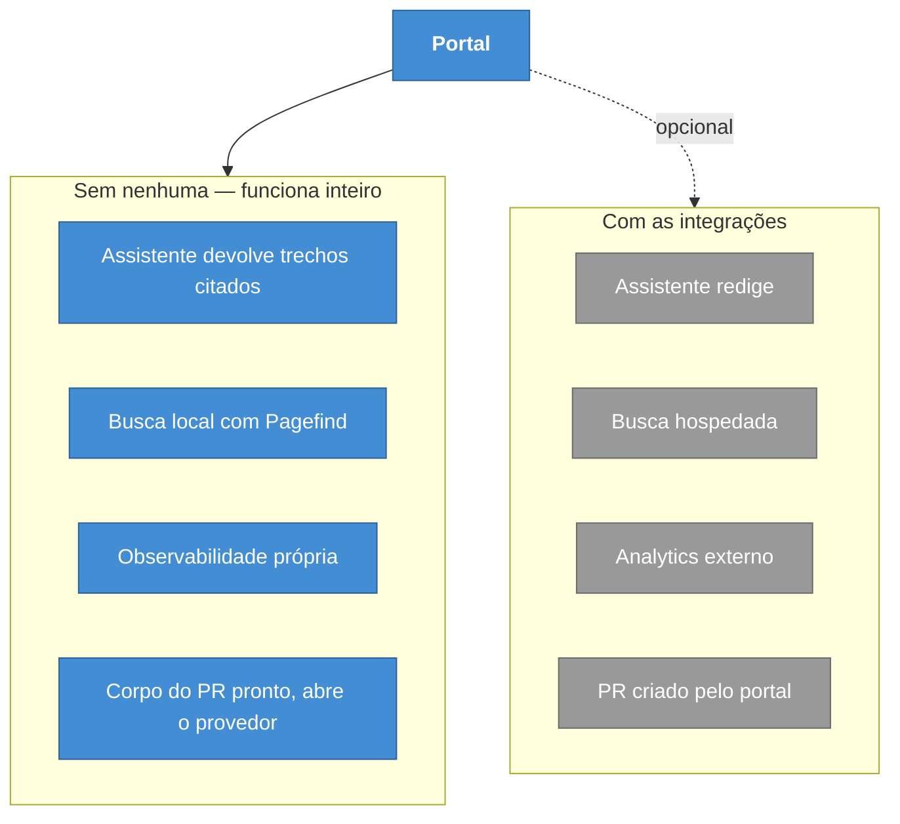

# ADR-0016 — Degradar em vez de depender

**Status:** Aceita · **Data:** 2026-05 · **Nível C4:** Contexto

## Contexto

O portal integra com quatro serviços externos: a API da Anthropic para redação
assistida, o Algolia DocSearch para busca hospedada, e o provedor de Git para
pull requests.

> A integração de analytics externo que existia aqui foi retirada pela
> [ADR-0019](0019-observabilidade-nativa-e-do11y.md). O raciocínio desta ADR não
> muda; o exemplo, sim.

Cada integração melhora alguma coisa. Cada uma também é um serviço que pode
estar fora, mudar de preço, ou simplesmente não ter sido contratado por quem
instalou o portal.

A pergunta arquitetural é o que acontece quando falta. Há duas respostas
possíveis, e a diferença não é técnica — é sobre o que o produto **é**.

## Decisão

**Nenhuma integração externa é obrigatória. A ausência degrada a funcionalidade,
nunca a interrompe.**

| Integração | Com | Sem — o padrão |
| --- | --- | --- |
| `ANTHROPIC_API_KEY` | O assistente redige a partir dos trechos | Devolve os trechos e um resumo extrativo, com fontes |
| Algolia DocSearch | Busca hospedada | Pagefind, local, gerado no build |
| `GITHUB_TOKEN` | O portal abre o pull request | Prepara o corpo e abre o provedor no navegador |

A regra vale também para as camadas internas: quando o Knowledge Graph não
consegue ler a governança, ele é montado sem ela e **declara a degradação** —
ver [ADR-0005](0005-camadas-derivadas.md).

## Consequências

**O que melhorou.** O portal roda com `npm install && npm run dev`, sem
credencial nenhuma, e todas as camadas de verificação funcionam. É o que permite
avaliar o produto antes de contratar qualquer coisa.

Nenhum segredo vai para o repositório: toda credencial vem do ambiente.

**O que custou.** Dois caminhos de código por integração, e o caminho degradado
precisa ser mantido e testado. Sem chave de modelo, o assistente tem um pipeline
inteiro — recuperação, ranqueamento, recorte, citação — que existe para o caso
em que não há modelo.

Alguns relatórios ficam menos úteis no modo degradado, e precisam dizer isso: a
avaliação de IA sem chave mede recuperação, não resposta gerada, e declara essa
limitação em cada caso e no resumo.

**O que passou a ser possível.** O assistente sem modelo não é uma versão
capenga — é um mecanismo de busca com citação obrigatória, que não inventa nada
porque não gera nada. Para muitos portais, é o comportamento preferível.

## Alternativas consideradas

**Exigir a chave de modelo.** Simplificaria o assistente a uma chamada e faria o
portal inútil para quem não pode enviar documentação a um provedor externo — o
que inclui parte de quem mais precisa de documentação interna boa.

**Falhar no build sem as integrações.** Descoberta imediata do problema e
barreira de entrada alta. Contraria a proposta de template white-label que se
avalia rodando.

**Modo degradado silencioso.** Funcionar sem avisar que está funcionando menos.
Foi descartado pelo mesmo princípio da [ADR-0008](0008-nao-medido-nunca-e-zero.md):
o relatório precisa dizer o que ele não sustenta.
