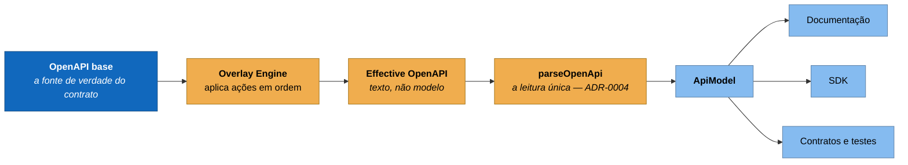

# ADR-0017 — Overlay é transformação antes do `ApiModel`

**Status:** Aceita · **Data:** 2026-08 · **Nível C4:** Componente

## Contexto

Uma mesma API precisa aparecer de formas diferentes para públicos diferentes. O
portal expõe rotas de ferramenta interna — `/editor/lint`, `/editor/git/branches`
— na mesma especificação que documenta as rotas públicas. Elas **precisam** estar
lá: o Digital Twin as usa para saber o que o produto implementa, e removê-las da
especificação derrubaria a cobertura para um número falso.

Mas publicá-las na referência externa convida alguém a integrar com um endpoint
que exige `editor.access` e pode mudar de forma sem aviso.

O caminho óbvio é manter dois arquivos: `openapi.yaml` e `openapi-public.yaml`.
Ele funciona por uma semana. Depois alguém corrige um `422` no primeiro e esquece
o segundo, e as duas cópias começam a divergir num ponto que ninguém compara.

A [OpenAPI Overlay Specification 1.0.0](https://spec.openapis.org/overlay/latest.html)
descreve o formato de uma transformação — uma lista de ações com alvo JSONPath e
`update`/`remove`. Ela diz o que é um overlay, e não onde ele entra no sistema.

## Decisão

**O overlay é uma transformação de documento, aplicada antes do `parseOpenApi`.**

Três consequências que decidem o que cada arquivo pode fazer:

**O motor não sabe o que é um endpoint.** Ele manipula YAML genérico —
`src/lib/overlay/` não importa nada de `api-explorer`. Quem entende de API
continua sendo o parser único da [ADR-0004](0004-uma-leitura-do-openapi.md).

**O seam é texto, não modelo.** `effectiveSpecText(view)` devolve YAML, que
`parseOpenApi` já sabe ler. Os dez consumidores existentes não mudam de forma.

**Não existe `ApiModel` de overlay.** Um segundo modelo derivado divergiria do
primeiro na primeira vez que alguém corrigisse um caso de borda em um dos dois —
que é exatamente o defeito que a ADR-0004 registra.

Acima do padrão vive uma abstração do projeto: a **API View**, um nome e a lista
ordenada de overlays que a produzem. O padrão descreve um arquivo; a view é o que
permite `--view public` significar a mesma coisa na documentação, no SDK, nos
contratos e nos testes.

## Consequências

**O que melhorou.** A mesma OpenAPI origina `base`, `public` e `partner` sem
duplicar uma linha de contrato. Medido no portal: 5 operações na base, 3 na
pública — as duas rotas de editor saem por overlay, e continuam no Digital Twin.

O overlay documenta a **intenção**, o que um segundo arquivo nunca faz. `remove:
true` com `description: "ferramenta interna do editor"` diz por que o endpoint
sumiu; um arquivo sem ele apenas não o tem.

**O que custou.** Uma etapa a mais antes de qualquer coisa que leia a
especificação, e um diretório derivado (`.generated/openapi/`) que precisa ser
reconstruído. Ele é ignorado pelo Git de propósito — versioná-lo criaria a
segunda cópia do contrato que esta decisão existe para evitar.

E há uma classe de defeito nova, tratada em
[ADR-0018](0018-alvo-sem-correspondencia.md): o overlay que "funciona" e não faz
efeito.

**O que passou a ser possível.** Governança sobre a transformação. Cada overlay
declara `x-lunar.owner` e `x-lunar.purpose`, e um overlay sem dono é uma
transformação de contrato que ninguém mantém — o mesmo raciocínio da
[ADR-0006](0006-autorizacao-por-capacidade.md) aplicado a artefato em vez de rota.

## Alternativas consideradas

**Dois arquivos de especificação.** O caminho que a decisão existe para evitar. A
divergência não é hipotética: ela acontece no primeiro `422` corrigido só de um
lado.

**Filtrar no consumidor** — a documentação esconde o que tem `x-internal: true`.
Espalha a regra por cada consumidor, e cada um a implementa um pouco diferente.
Foi o que a [ADR-0005](0005-camadas-derivadas.md) já rejeitou noutro contexto:
duas respostas para a mesma pergunta divergem.

**Aplicar o overlay depois do `ApiModel`**, transformando o modelo em vez do
documento. Tentador — evita reserializar YAML — e obriga o motor a conhecer a
forma do `ApiModel`, que muda quando um consumidor precisa de um campo novo. O
documento é a interface mais estável das duas.

**Uma biblioteca pronta de overlay.** Resolveria o `apply` e devolveria o resto:
a proveniência, a detecção de conflito, as views e a integração com governança e
CI são o que este projeto acrescenta. Ver também
[ADR-0018](0018-alvo-sem-correspondencia.md) sobre o JSONPath.
