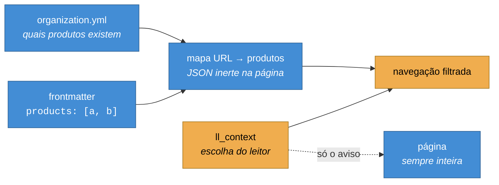

# ADR-0021 — Produto particiona a navegação, não o acesso

**Status:** Aceita · **Data:** 2026-08 · **Nível C4:** Componente

## Contexto

O portal passou a documentar mais de um produto. Quem trabalha com um deles
navegava por uma lista que misturava guias de todos — e a maior parte dela não
respondia nenhuma pergunta que essa pessoa pudesse ter.

A dificuldade é que o portal já tem uma camada de personalização, a documentação
adaptativa, e ela é regida por um princípio explícito (§12): **personalização
não pode remover informação, quebrar navegação ou impedir acesso ao conteúdo
completo**. O `AudienceSwitcher` obedece isso literalmente — escolher uma
audiência recolhe blocos `
`, e recolhido continua no documento,
alcançável por teclado e pela busca do navegador.

Aplicar a mesma régua a produto produziria um seletor que não resolve o
problema: a navegação continuaria listando tudo, só que em outra ordem.

Havia ainda uma restrição de forma. A [ADR-0003](0003-renderizacao-hibrida.md)
estabelece que as páginas de documentação são **pré-renderizadas**: existe um
HTML só, gerado no build, servido igual para todo mundo. Não há requisição por
leitor em que o servidor pudesse montar uma navegação diferente por pessoa.

## Decisão

**Produto esconde da navegação. Produto nunca esconde a página.**

A distinção que sustenta isso: audiência é *perspectiva sobre o mesmo assunto* —
o guia de webhooks é o mesmo guia para quem desenvolve e para quem dá suporte.
Produto é *assunto diferente*. Uma página do produto B não é uma visão
alternativa da documentação do A; é documentação de outra coisa. Mantê-la na
navegação do A não preserva informação, só enche a lista de respostas para
perguntas que ninguém fez.

O que fica garantido, e é o que a §12 realmente protege:

- Nenhuma URL deixa de funcionar. Link antigo, resultado de busca externa e
  histórico do navegador continuam levando à página, servida inteira.
- Quem chega numa página de outro produto recebe um aviso dizendo de qual
  produto ela é, com um botão para trocar — em vez de um 404 ou de uma página
  que parece não valer para nada.
- Página sem `products` no frontmatter é **compartilhada**: aparece na navegação
  de todos os produtos. É o caso da maior parte da documentação, e o padrão
  precisa ser o inclusivo.

A filtragem roda **no navegador**. O servidor publica um mapa de URL → produtos
como JSON inerte na página; o script lê o mapa, lê a escolha do leitor no cookie
`ll_context` e esconde os links que não pertencem. É o mesmo arranjo do
`AudienceSwitcher`, e pela mesma razão: a página é estática.

Os produtos vêm de `organization.yml`, que já os declarava para o painel de
Enterprise/Multi-repository. Não há um `products.yml` novo.

## Consequências

**O que melhorou.** A navegação de um produto tem o tamanho daquele produto.
Um portal com cinco produtos deixa de ter uma barra lateral com cinco vezes mais
itens do que qualquer leitor precisa.

**O que custou.** Um erro de digitação em `products:` tira a página da navegação
de **todos** os produtos, porque ela passa a pertencer a um produto que ninguém
pode selecionar. O sintoma ("sumiu da navegação") aparece longe da causa
("faltou uma letra no frontmatter"). Por isso o build avisa, por página e por
produto — sem o aviso, essa é uma falha que leva semanas para alguém notar.

**O que continua fora.** A busca (Pagefind) tem um índice só, construído no
build, e não é filtrada por produto. O assistente, o MCP e o linter continuam
operando sobre o conteúdo inteiro — a mesma limitação que o versionamento já
declara.

**O que isto não é.** Não é controle de acesso. Nenhuma página do portal é
secreta: `docs/limitacoes.md` já registra que a leitura é pública por decisão de
produto. A [ADR-0003](0003-renderizacao-hibrida.md) descartou esconder o botão
"Editar esta página" por CSS porque *"escondido na interface não é propriedade
de segurança"* — e isso continua verdade. A diferença é o que está em jogo:
aquele botão era uma capacidade que precisava ser negada de fato; aqui não há
nada a negar, só uma lista a encurtar. Se algum dia existir documentação que uma
pessoa não possa ler, ela não pode depender deste mecanismo.

## Alternativas consideradas

**Partição total, com 404 para página de outro produto.** Separação mais forte, e
descartada por dois motivos. Quebraria todo link já compartilhado no momento em
que alguém trocasse de produto, e transformaria uma preferência de navegação
numa fronteira de acesso — que é justamente o que a §12 proíbe.

**Sinal suave, só reordenando.** Consistente com o `AudienceSwitcher` e
insuficiente: a issue pede "ao selecionar o produto A eu vejo todos os guias do
produto A", e reordenar não entrega isso. Além disso trataria produto como
perspectiva, que é o que ele não é.

**Diretório por produto (`src/content/docs/<produto>/`).** Separação física, sem
frontmatter. Exigiria migrar todo o conteúdo, mudaria todas as URLs, e colidiria
com os diretórios de idioma (`en/`, `es/`) que já ocupam esse nível da árvore.

**Um `products.yml` próprio.** Criaria um segundo espaço de identificador de
produto, ao lado do que `organization.yml` já mantém. Dois registros de produto
só divergem no dia em que alguém edita um e esquece o outro — e o sintoma seria
uma página sumindo da navegação porque o produto dela "não existe" em metade do
sistema.
