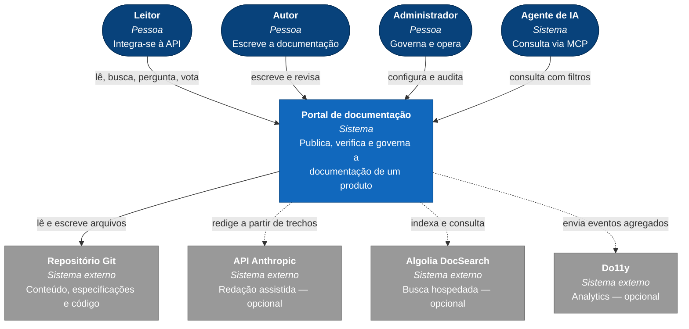
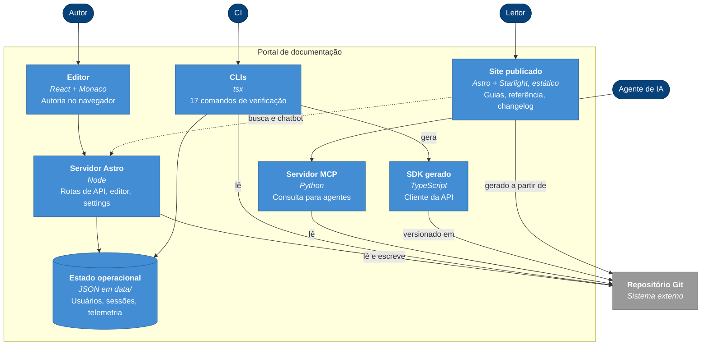
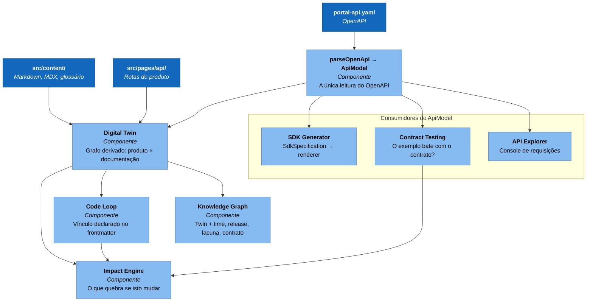
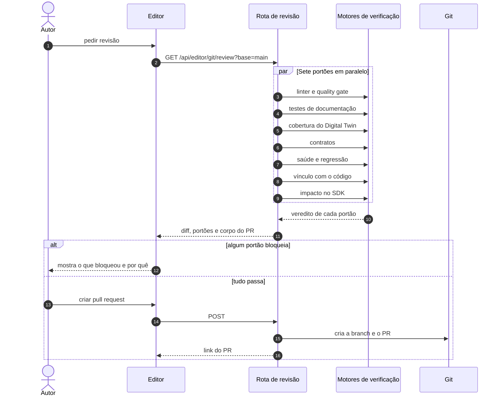
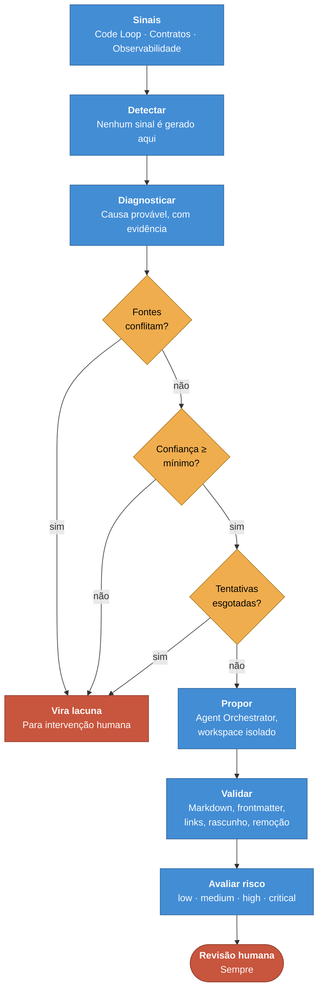

# Arquitetura

Este documento descreve o portal nos níveis do [modelo C4](https://c4model.com/):
contexto, contêineres, componentes e um diagrama dinâmico. As **decisões** que
levaram a esta forma estão registradas em [ADRs](adr/), e cada nível aponta as
que o explicam.

## Uma nota sobre a notação

Os diagramas usam Mermaid `flowchart` com a semântica do C4 — pessoa, sistema,
contêiner, componente — em vez da sintaxe `C4Context` do Mermaid.

O C4 é um modelo, não uma sintaxe: o que importa é a hierarquia de níveis e o
significado das caixas. A sintaxe `C4Context` continua marcada como experimental
e falha de render em algumas versões; `flowchart` renderiza no GitHub, no VS
Code e em qualquer visualizador que entenda Mermaid.

Estes diagramas ficam em `docs/`, lido no GitHub. Os diagramas do **portal
publicado** são SVG escrito à mão — ver [ADR-0015](adr/0015-diagramas-como-svg-versionado.md).

```text
Legenda
  ┌────────────┐   Pessoa            ┌────────────┐   Contêiner
  │  redondo   │                     │  retângulo │   (processo, app, banco)
  └────────────┘                     └────────────┘
  ╔════════════╗   Sistema externo   ┌ ─ ─ ─ ─ ─ ─┐   Componente
  ╚════════════╝                     └ ─ ─ ─ ─ ─ ─┘   (dentro de um contêiner)
```

---

## Nível 1 — Contexto

Quem usa o portal e com o que ele conversa.



As três setas tracejadas são **opcionais e desligadas por padrão**. Sem nenhuma
delas o portal funciona inteiro: a busca é local, o assistente devolve trechos
sem redigir, e não há analytics externo. Ver
[ADR-0016](adr/0016-degradacao-em-vez-de-dependencia.md).

O repositório Git é a única seta cheia para fora, e isso é o ponto:
[ADR-0002](adr/0002-git-como-fonte-de-verdade.md).

---

## Nível 2 — Contêineres

O que roda, e onde o estado vive.



Três coisas para notar:

1. **O conteúdo nunca passa por `data/`.** Markdown, especificações e SDK vão
   para o Git; usuários, sessões e telemetria ficam em `data/`, que é ignorado
   pelo Git. [ADR-0007](adr/0007-estado-operacional-fora-do-git.md).
2. **As CLIs leem o mesmo repositório que o servidor**, e não uma cópia
   indexada. É o que permite rodar toda verificação em CI sem subir o portal.
3. **O site é estático; o servidor existe para o que não pode ser.**
   [ADR-0003](adr/0003-renderizacao-hibrida.md).

---

## Nível 3 — Componentes do núcleo de análise

O nível onde mora a decisão mais estrutural do projeto: **uma leitura do
OpenAPI, muitos consumidores**.



Nenhuma seta entra em `parseOpenApi` vinda de um consumidor, e nenhum consumidor
abre YAML. Quando o gerador de SDK precisou de schemas nomeados, o `ApiModel`
ganhou o campo — abrir o arquivo de novo daria duas leituras da mesma
especificação, e a segunda envelheceria.
[ADR-0004](adr/0004-uma-leitura-do-openapi.md).

Twin, Knowledge Graph e Content Graph são **derivados**. Se algum discordar do
repositório, o errado é ele. [ADR-0005](adr/0005-camadas-derivadas.md).

---

## Diagrama dinâmico — o portão de pull request

O que acontece quando alguém pede revisão no editor.



Os sete portões rodam em paralelo e **nem todos bloqueiam**. Ruptura de contrato
e entidade pública sem documentação bloqueiam; SDK fora de sincronia, revisão
vencida e página potencialmente defasada avisam.
[ADR-0012](adr/0012-portoes-que-bloqueiam-pouco.md).

---

## Diagrama dinâmico — o ciclo de self-healing

O caminho de um problema até uma proposta, e os quatro lugares onde ele para.



Nenhum caminho leva a "publicar". A caixa final é sempre revisão humana, em
qualquer nível de autonomia.
[ADR-0010](adr/0010-guardrails-por-construcao.md).

---

## Onde continuar

| Documento | O que explica |
| --- | --- |
| [ADRs](adr/) | Por que cada decisão foi tomada, e o que ela custou |
| [docs/content-graph.md](content-graph.md) | O grafo de dependências de conteúdo |
| [docs/controle-de-acesso.md](controle-de-acesso.md) | Papéis, capacidades e as proteções contra escalação |
| [docs/linter.md](linter.md) | As regras do linter e o cálculo da nota |
| [docs/glossario.md](glossario.md) | O glossário como fonte, o linter como consumidor |
