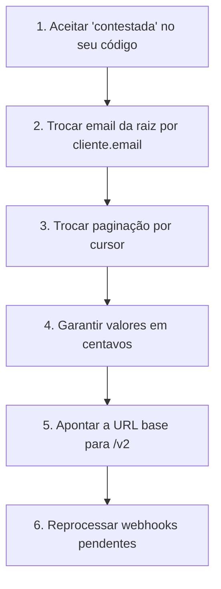

A v2 da Órbita entra em 2026-11-01. A v1 continua atendendo até 2027-05-01 — seis meses de sobreposição.

Depois dessa data, chamadas à v1 devolvem `410 Gone` com o link desta página.

## O que quebra

### `cliente.email` deixa de ser aceito na raiz

```diff
  {
    "valor": 4990,
    "moeda": "BRL",
-   "email": "pessoa@empresa.com"
+   "cliente": { "email": "pessoa@empresa.com" }
  }
```

Na v1 os dois formatos funcionavam. A v2 aceita só o segundo, e o primeiro devolve `422`.

### `status` ganha um valor novo

`contestada` passa a existir entre `aprovada` e `estornada`.

Um `switch` exaustivo sobre `status` na v1 vai cair no `default` quando este valor chegar. Isso não é um erro da v2 — é o motivo pelo qual a v1 nunca prometeu que a lista de estados era fechada.

```ts
// Isto quebra silenciosamente na v2.
switch (cobranca.status) {
  case 'aprovada': return liberar();
  case 'recusada': return avisar();
  case 'estornada': return devolver();
}

// Isto continua correto.
switch (cobranca.status) {
  case 'aprovada': return liberar();
  case 'recusada': return avisar();
  case 'estornada': return devolver();
  default: return registrarParaRevisao(cobranca);
}
```

### Paginação por página some

`GET /v1/cobrancas?pagina=2` era aceito e desalinhava quando um item novo entrava no topo. A v2 aceita só cursor:

```diff
- GET /v1/cobrancas?pagina=2&porPagina=50
+ GET /v2/cobrancas?limite=50&depois=cob_8f2a
```

### `valor` decimal deixa de ser tolerado

A v1 aceitava `49.90` e convertia. A v2 devolve `422`.

A tolerância foi um erro: ela escondia bugs de arredondamento do lado de quem chamava, e o dinheiro errado só aparecia na conciliação do fim do mês.

## O que continua igual

- Autenticação, chaves e escopos.
- Formato do erro, incluindo `requestId`.
- Idempotência e a janela de 24 horas.
- Assinatura de webhook e a janela de cinco minutos.

## Ordem de migração



Os passos 1 a 4 são compatíveis com a v1 — dá para fazê-los em produção, um por vez, antes de trocar a URL. Só o passo 5 muda de versão.

:::tip[Migre antes de precisar]
Fazer 1 a 4 primeiro significa que o passo 5 é uma linha de configuração, reversível em segundos. Fazer tudo junto significa descobrir os quatro problemas ao mesmo tempo, em produção.
:::

## Rodar as duas versões

A chave é a mesma nas duas versões. Nada impede apontar parte do tráfego para a v2 e o resto para a v1 durante a transição — inclusive dentro da mesma aplicação.

Webhooks, porém, são por organização, não por versão: uma vez que você escolhe o formato v2 no painel, **todos** os seus endpoints passam a recebê-lo.

---

### O que esta página demonstra

| Recurso | Onde aparece |
| --- | --- |
| [Governança](/guides/governanca/) | O frontmatter declara `approver`, exigido para mudança incompatível |
| [Vínculo com o código](/guides/vinculo-com-o-codigo/) | Guia de migração reconhecido pelo nome do arquivo e pelo título |
| [Versionamento](/guides/versionamento/) | Duas versões documentadas com sobreposição declarada |
| [Diagramas](/guides/diagramas/) | O fluxograma da ordem de migração |

O Documentation-to-Code Loop procura um guia de migração sempre que detecta uma mudança incompatível. Esta página é o tipo de arquivo que ele encontra: o nome contém *migração*, e o título também.
