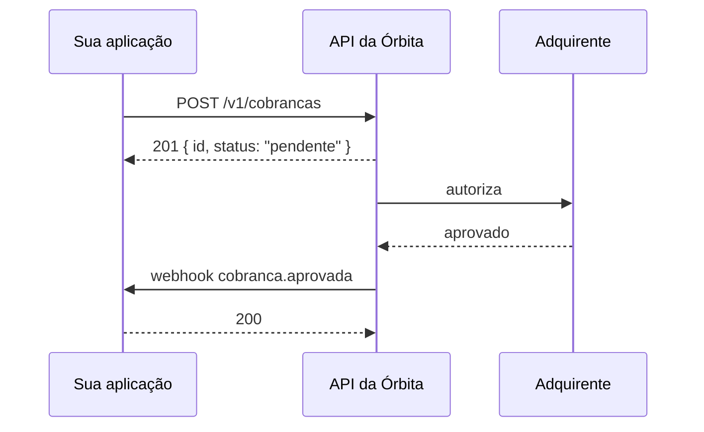

import ContentBlock from '../../../components/content/ContentBlock.astro';

A Órbita cobra em três chamadas: você se autentica, cria uma cobrança e escuta a confirmação. Este guia percorre as três.

<ContentBlock id="authentication-warning" />

## O percurso



O ponto que costuma surpreender está na quarta linha: a resposta do `POST` chega **antes** da autorização. A cobrança nasce `pendente`, e quem decide se ela foi aprovada é o webhook — não o corpo da resposta.

## 1. Autenticação

A Órbita usa uma chave de API no cabeçalho `Authorization`.

:::audience{type="developer"}
A chave vive no ambiente, nunca no código. Toda requisição autenticada leva o cabeçalho, inclusive as de leitura:

```bash
curl https://api.orbita.exemplo/v1/cobrancas \
  -H "Authorization: Bearer $ORBITA_API_KEY"
```

Chaves de teste começam com `orb_test_` e nunca movem dinheiro. As de produção começam com `orb_live_` e movem.
:::

:::audience{type="support"}
Se a pessoa relatar erro `401`, confira nesta ordem:

1. O cabeçalho `Authorization` está presente?
2. A chave começa com `orb_test_` num ambiente de produção, ou o contrário?
3. A chave foi revogada no painel? Revogação é imediata e não tem desfazer.

O erro `401` da Órbita nunca distingue "chave não existe" de "chave revogada" — a distinção ajudaria quem digitou errado e ajudaria mais ainda quem está testando chaves.
:::

:::audience{type="product"}
Cada organização começa com uma chave de teste. Chaves de produção exigem a conta verificada, o que leva de um a dois dias úteis.
:::

## 2. Criar a cobrança

```bash
curl -X POST https://api.orbita.exemplo/v1/cobrancas \
  -H "Authorization: Bearer $ORBITA_API_KEY" \
  -H "Content-Type: application/json" \
  -d '{
    "valor": 4990,
    "moeda": "BRL",
    "descricao": "Assinatura mensal",
    "cliente": { "email": "pessoa@empresa.com" }
  }'
```

```json
{
  "id": "cob_8f2a",
  "status": "pendente",
  "valor": 4990,
  "moeda": "BRL",
  "criadaEm": "2026-08-19T14:32:00Z"
}
```

:::note[Valores em centavos]
`valor` é sempre um inteiro em centavos. `4990` são R$ 49,90.

A API não aceita decimais em lugar nenhum, e a razão é aritmética: `0.1 + 0.2` não dá `0.3` em ponto flutuante, e um sistema de pagamentos que erra na terceira casa erra em dinheiro de verdade.
:::

## 3. Receber a confirmação

A cobrança aprovada dispara o webhook `cobranca.aprovada`. Detalhes em [Webhooks](/exemplos/webhooks/).

<ContentBlock id="rate-limit" />

## Erros comuns na primeira integração

| Sintoma | Causa provável |
| --- | --- |
| `401` em toda chamada | Chave de teste em produção, ou o contrário. |
| `422` com `valor` | Valor decimal em vez de centavos. |
| Cobrança fica `pendente` para sempre | O webhook não está sendo recebido — confira o endereço registrado. |
| `429` no ambiente de teste | O limite de teste é mais baixo que o de produção, de propósito. |

---

### O que esta página demonstra

| Recurso | Onde aparece |
| --- | --- |
| [Documentação adaptativa](/guides/documentacao-adaptativa/) | Os três blocos `:::audience` da autenticação |
| [Conteúdo reutilizável](/guides/conteudo-reutilizavel/) | `<ContentBlock id="authentication-warning" />` e `rate-limit` |
| [Glossário](/guides/glossario/) | O termo *chave de API*, destacado com a definição ao passar o mouse |
| [Diagramas](/guides/diagramas/) | O diagrama de sequência do percurso |
| [Linter](/guides/linter-e-quality-score/) | A página inteira, analisada por `npm run docs:lint` |
